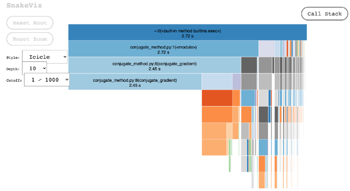
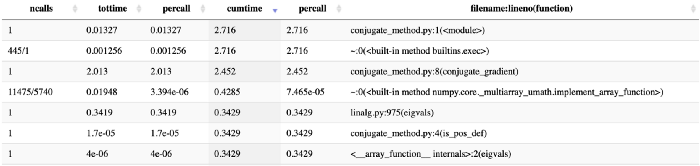

# How to assess your code performance in Python
*cProfile and line_profiler*


Profiling helps us identify bottlenecks and optimize performance in our code. If our code runs slowly, we can identify where our code is slow and then make corresponding improvements.

Here are the explanations of Python profilers from the [Python documentation](https://docs.python.org/3/library/profile.html):

"cProfile and profile provide deterministic profiling of Python programs. A profile is a set of statistics that describes how often and for how long various parts of the program executed…cProfile is recommended for most users; it’s a C extension with reasonable overhead that makes it suitable for profiling long-running programs."

cProfile is a Python built-in profiler, which is great for measuring the time spent at each function and how many times each function is executed. Let’s start with an example of cProfile.

## cProfile
Here is a Python script solving a linear system with the conjugate gradient method. Details of the calculation can be found in my other [article](https://medium.com/dsc-msit/descent-method-steepest-descent-and-conjugate-gradient-in-python-85aa4c4aac7b). To run this Python script, we can simply do `python conjugate_method_cprofile.py`.

<script src="https://gist.github.com/sophiamyang/81627ae9c3fe0732dea3b5b7fe1a07db.js"></script>


To profile with cProfile, run the following code in your terminal and save results to p0.prof.
```
python -m cProfile -o p0.prof conjugate_method.py 
```
Then we can use `snakeviz` to visualize the results.
```
conda install snakeviz 
snakeviz p0.prof
```
Here is what we get from `snakeviz`, which shows the name of the functions and time spent in each function. For example, in this example, our program conjugate_method.py takes most of the time, and calculating whether our matrix is symmetric positive definite, which includes calculating eigenvalues, takes some time as well.





## line_profiler
The other profiling technique I use quite often is line profiling. Line profiling gives us information about the execution time for each line of our code. This is especially helpful when we have a specific function to dig into. To use line profiler, first we need to add a decorator `@profile` in front of our function in the Python script. See line 8 in this example:

<script src="https://gist.github.com/sophiamyang/48d46f9c252cb3de797072b672eaabae.js"></script>

Then we can run the following code to do the line profiling:
```
conda install line_profiler
kernprof -l conjugate_method_lineprofile.py
python -m line_profiler conjugate_method_lineprofile.py.lprof
```
Results show the time spent on each line of our function. Here we can see most of the time spent on lines 19, 21, 23, and 10. If we want to improve our performance, we need to think of ways to optimize those lines.


These are my two favorite tools for profiling Python code. In the examples, I used them from the terminal, but you can also use them as magic in Jupyter Notebooks. See this [video](https://anaconda.cloud/tutorials/5996898c-1a5b-4ec1-8697-704144d5b025) for details. There are other profiling tools you can use. For example, you can simply use timeit to get the time spent on the entire function. You can also profile memory usage. Hope you enjoy playing with profiling!

Reference:  
https://medium.com/dsc-msit/descent-method-steepest-descent-and-conjugate-gradient-in-python-85aa4c4aac7b 
https://docs.python.org/3/library/profile.html 
https://anaconda.cloud/tutorials/5996898c-1a5b-4ec1-8697-704144d5b025 

By Sophia Yang on [December 3, 2020](https://towardsdatascience.com/how-to-assess-your-code-performance-in-python-346a17880c9f)