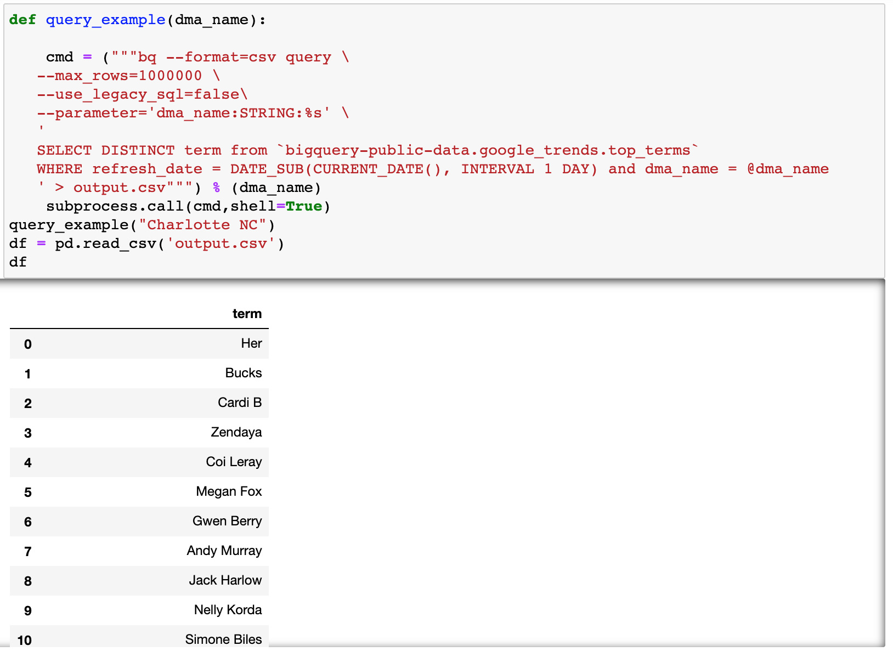

# 3 ways to query BigQuery in Python 
*SQLAlchemy, Python Client for Google BigQuery, and bq command-line tool*

How do you query BigQuery data? This article talks about 3 ways to query BigQuery data in Python. Hope you find them useful. 

## Environment
```
conda install notebook google-cloud-bigquery sqlalchemy pybigquery
```

### Credentials
To authenticate Google Cloud locally, you will need to install [Google Cloud SDK](https://cloud.google.com/sdk/docs/install)  and log in/authenticate through the following command line. More information can be found in the [official documentation](https://googleapis.dev/python/google-api-core/latest/auth.html). 
```
gcloud auth login
```

To authenticate through a credential file, you can create a service account and get the credential from the service account: 
Go to the google cloud [service account page](https://console.cloud.google.com/iam-admin/serviceaccounts), click on a project, click "+CREATE SERVICE ACCOUNT" and then it will generate a credential JSON file. In the following examples below, I renamed this credential file to “BIGQUERY_CREDENTAIL”. 

## SQLAlchemy for BigQuery
The [pybigquery](https://github.com/googleapis/python-bigquery-sqlalchemy) project implements a SQLAlchemy tool for BigQuery. 
SQLAlchemy is a powerful tool to read SQL data in Python. Here is a description of SQLAlchemy from the [documentation](https://www.sqlalchemy.org/): 

*SQLAlchemy is the Python SQL toolkit and Object Relational Mapper that gives application developers the full power and flexibility of SQL*.

To use SQLAlchemy, the first step is to establish connectivity by using `create_engine()`. In the arguments of this function, we define the database we are trying to connect to `“bigquery://”` and the path of the credential file. If you are running it locally and authenticated locally, you can run the following without the credential info. If the output data is large, we can increase arraysize, which by default is 5000. 

After we establish the connection to BigQuery, there are multiple ways to query the data. My go-to method is to use `pd.read_sql` from Pandas so that I can get a Pandas dataframe directly. 
In the `pd.read_sql` function, all we need is the specified query and the connection. 


It is often useful to parameterize our queries. SQLAlchemy provides a built in function `text()` that accepts query as input and supports [paramerizations](https://docs.sqlalchemy.org/en/14/core/tutorial.html#specifying-bound-parameter-behaviors). Alternatively, you can write the parameters as f-strings in the query.

## Python Client for Google BigQuery
The second approach is to use the official [Python Client for BigQuery](https://googleapis.dev/python/bigquery/latest/index.html). If you are running it locally and you are authenticated, you don’t need to define the credentials, and `client = bigquery.Client()` will just work. 


## bq command-line tool
The third approach is to use subprocess to run the bq command-line tool. The query command is `bq query`.  We can pass in flags to the query to define the output format to be csv and specify the queries we want to run. Then we can use subprocess to run the command line code in Python. 


bq command line tool supports query parameters. In the example below, we pass in the `--parameter` flag to define the name, type, and value information of the parameter. In the query itself we use `@parameter` name to specify a parameter. Another thing to note is that if the output has too many rows, we can increase the `--max_rows` flag to be a large number. 



## Summary
In all, I quickly went through three ways to query BigQuery in Python.

The first approach, SQLAlchemy has many nice built-in functionalities and supports many different types of databases. For users who have used SQLAlchemy on other databases and liked its features, you might like the SQLAlchemy approach to query BigQuery.

The second approach is the official Python Client for Google BigQuery, which I personally find not quite as easy to use and the documentation could be better. I haven't use it as much, so my impression could be wrong.

Finally, the bq command line tool is very powerful.  It offers a broad set of functionality, not just querying data. I know a lot of people have concerns and prefer not to use subprocess. So it’s really up to your preferences on which one to use. 

Happy BigQuerying! 

## References

https://googleapis.dev/python/google-api-core/latest/auth.html
https://github.com/googleapis/python-bigquery-sqlalchemy
https://www.sqlalchemy.org/
https://github.com/googleapis/python-bigquery
https://googleapis.dev/python/bigquery/latest/index.html


By Sophia Yang on June 28, 2021