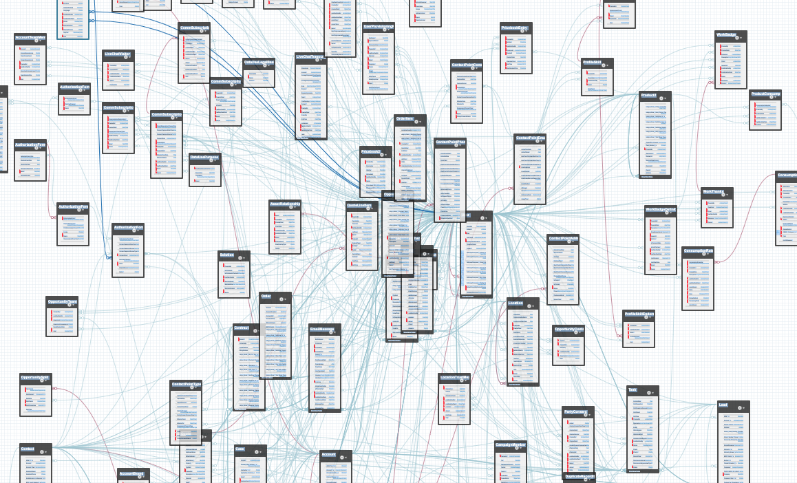
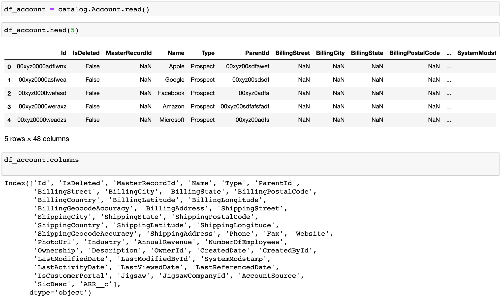
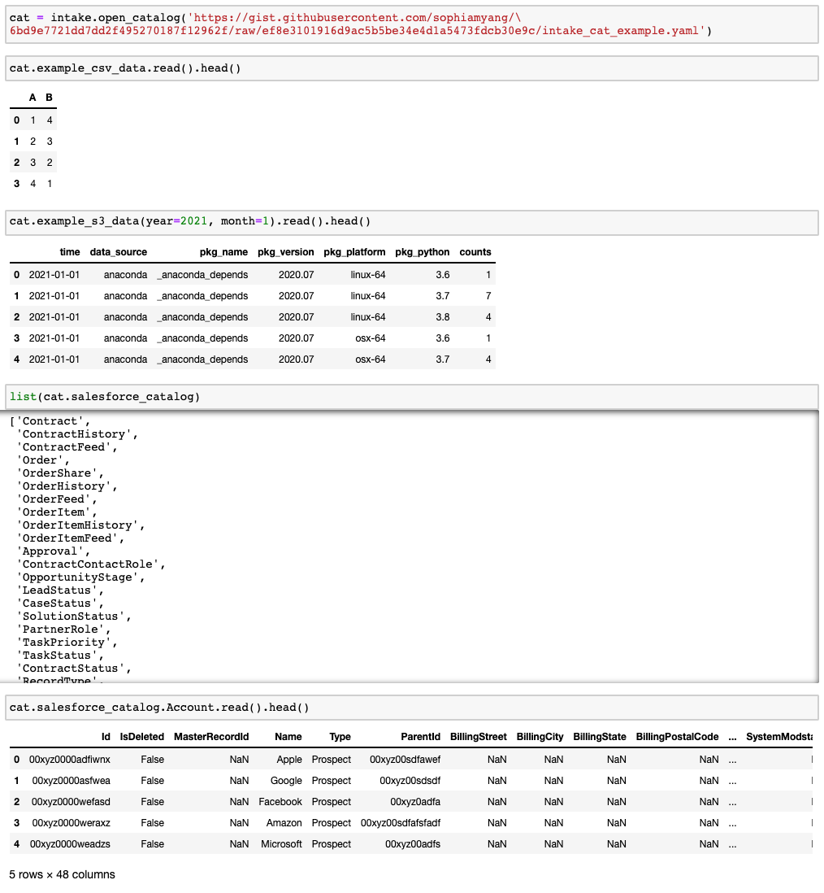

# Query Salesforce Data in Python using intake-salesforce
*Intake driver for salesforce*

A Salesforce database can be a hot mess. The figure below illustrates the relationship among some of the data tables in Salesforce. As you can see, the relationship among data tables (i.e., objects) can be complicated and hard to work with. I wrote a [blog post](https://medium.com/swlh/query-salesforce-data-in-python-e290a00e3cba) previously on how to understand and query Salesforce data using the [Salesforce Object Query Language (SOQL)](https://developer.salesforce.com/docs/atlas.en-us.soql_sosl.meta/soql_sosl/sforce_api_calls_soql.htm) through a Python API simple-salesforce.  Salesforce Object Query Language (SOQL) is a SQL-like language that is designed specifically for the relational data in Salesforce and it is not the easiest to understand and write for people who are not familiar with the Salesforce database. Thus, I wrote an intake driver to load salesforce data to help people query Salesforce data easily. 



## What is Intake? 
Intake was developed by Anaconda in 2018. It is a lightweight data catalog and data access library. It helps users to access data and share data more productively. Specifically, Intake has the following key features that make it desirable to data scientists:
- Intake loads data from various data sources and provides descriptions of your data in Intake catalogs.
- Caching helps to load data faster.
- Intake allows users to create a data package easily.
- Graphic Interface helps with easy data exploration.
- Intake loads data from various data formats and allows users to create plugins/drivers for new file formats. 
- The intake ecosystem currently includes more than 30 [intake drivers](https://intake.readthedocs.io/en/latest/plugin-directory.html) that help users to load data from different sources with a uniform API.

More information on how to use intake can be found in the [intake documentation](https://intake.readthedocs.io/en/latest/). 

## How to use intake-salesforce?
Before we get started on intake-salesforce, we need to get some Salesforce credential information: 
- Username
- Password 
- Security token: can be found under Settings - Personal - Reset My Security Token
- Instance: YOUR_COMPANY_NAME.lightning.force.com

To install intake-salesforce, run the following
```
conda install intake pandas 
pip install intake-salesforce 
```

To get a catalog of tables in Salesforce, we use the `intake.open_salesforce_catalog` method:


Now we have a list of 1003 tables, which we can read using `catalog.TABLE_NAME.read()` and return Pandas dataframes in memory. For example, let’s read in the “Account” table (not real data):



There are 48 columns in the Account table. Note that the column names ending with __c are all custom objects in Salesforce, which means in this case, our Salesforce admin creates a variable object called “ARR__c” in the Account table object. 

Similarly, we can read in other tables (e.g., Opportunity) and merge the Account table with the Opportunity table (again, not real data shown below). To be clear which variables belong to which table, I added “acc_” in front of the Account variables and “opp_” in front of the Opportunity variables. Here we see the merged table has 90 columns. 


## Putting everything together
How do we load data from various sources in a consistent manner? We are going to show an example to load a local .csv file, a group of parquet files that’s stored on AWS, and Salesforce data. 

The key feature and concept of Intake is the catalog files, which is "a YAML specification file which contains a list of named entries describing how to load data sources" (https://intake.readthedocs.io/en/latest/catalog.html). In the “load_data.yaml” example below, we defined three data sources: example_csv_data, example_s3_data, and salesforce_catalog. Under each data source, we listed its intake driver, arguments, and other information. Note that we are loading all data as Pandas dataframes, other data types and partitioned/parallel access are also possible with Intake. 

```
sources:
  example_csv_data:
    args:
      urlpath: "example.csv"
    description: "Example data"
    driver: csv
  example_s3_data:
    driver: parquet
    cache:
      - argkey: urlpath
        regex: 'anaconda-package-data'
        type: file
    parameters:
      year:
        description: year
        type: int
      month:
        description: month
        type: int
    args:
        urlpath: 's3://anaconda-package-data/conda/hourly/{{ "%04d" | format(year) }}/{{ "%02d" | format(month) }}/{{ "%04d" | format(year) }}-{{ "%02d" | format(month) }}-*.parquet'
        storage_options: {'anon': True}
  salesforce_catalog:
    driver: salesforce_catalog
    args: 
      username: "{{env(username)}}"
      password: "{{env(password)}}"
      security_token: "{{env(security_token)}}"
      instance: "{{env(instance)}}"
```


To load data from these three data sources, we can simply open this yaml file as the catalog `cat` and read in data as follows: 
- Read .csv file: `cat.example_csv_data.read()` 
- Read .parquet file: `cat.example_s3_data(year=xxx, month=xxx).read()`. Note that we need to `conda install intake-parquet s3fs python-snappy` first, and also note we are able to pass in arguments as parameters. 
- Read Salesforce data: `cat.salesforce_catalog` shows a list of Salesforce tables and `cat.salesforce_catalog.TABLE_NAME.read()` reads in the specified table.  



In summary, intake-salesforce provides an easy way for users to see a catalog of tables in Salesforce and read in specific data tables as Pandas dataframes. Intake catalog allows users to load data from various sources consistently. Hope you enjoy using Intake and Intake-Salesforce. Thanks! 

Credit: Special thanks to Martin Durant, Albert DeFusco, and Stan Seibert for the guidance and feedback in developing intake-Salesforce and writing this article. 

## References: 
https://intake.readthedocs.io/
https://www.anaconda.com/intake-taking-the-pain-out-of-data-access/
https://martindurant.github.io/blog/flurry-of-drivers/
https://medium.com/swlh/query-salesforce-data-in-python-e290a00e3cba
https://developer.salesforce.com/docs/atlas.en-us.soql_sosl.meta/soql_sosl/sforce_api_calls_soql.htm
 
By Sophia Yang on July 1, 2021