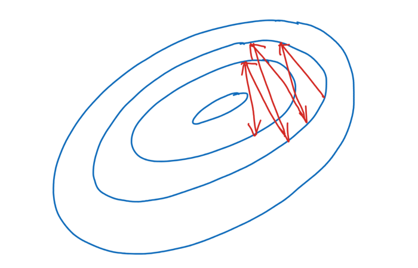

# Deep learning basics — input normalization

## What is input normalization?
Input normalization normalizes the input of the network so that the each dimension/channel of the input have a mean of 0 and a variance of 1.

The equation is simply: 𝑥=(𝑥−𝜇)/𝜎

Note that we are doing this operation for each dimension/channel. x is the input data for each channel, 𝜇 is the mean for each channel, and 𝜎 is the standard deviation for each channel.

## Why do we need input normalization?
- Train the first layer faster.
- Avoid network focus on the dimensions with large input.
- Be able to use larger learning rate

Assuming we have two dimensions in our data, if one dimension (a) is much larger than the other dimension (b). Then the gradient of the loss in terms of the weight of a is a lot larger than the gradient of the loss respect to weight of b. The loss function would look like something below. Any changes in one weight, from the smaller dimension b, might lead to small change in the loss, which does not make much influence to the loss. However, a small change in the other weight might lead to a very large change in the loss. Then the gradient descent might take many small steps, with very small learning rate, and zigzag very slowly to the minimum.

## How do we implement input normalization in PyTorch?
Assuming our training data (e.g., images) has 128 batch size, 3 channels, 60 width, and 60 height. The shape of each of our training data iteration should be torch.Size([128, 3, 60, 60]) . Now we want to calculate the mean and standard deviation for each channel. Here is how we can do it:

`channel_means` calculated mean values for each channel and each batch. `channel_mean` further takes the average of all batches and calculate the overall mean for each channel. Similarly, `channel_stds` calculated standard deviations for each channel and each batch. `channel_std` further takes the average of all batches and calculate the overall standard deviation for each channel.

Then we can normalized the data using this `Normalize` class.

And then in the `forward` function in our network. We can normalize the input data first, before we run the data through our network.

Reference:  
https://discuss.pytorch.org/t/input-normalization-inside-the-model/56260

By Sophia Yang on [September 10, 2020](https://medium.com/analytics-vidhya/deep-learning-basics-input-normalization-670735d3a832).