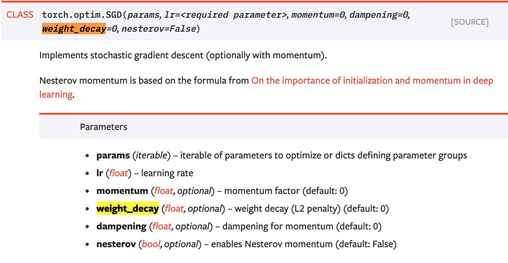

# Deep learning basics — weight decay

## What is weight decay?
Weight decay is a regularization technique by adding a small penalty, usually the L2 norm of the weights (all the weights of the model), to the loss function.

loss = loss + weight decay parameter * L2 norm of the weights

Some people prefer to only apply weight decay to the weights and not the bias. PyTorch applies weight decay to both weights and bias.

## Why do we use weight decay?
- To prevent overfitting.
- To keep the weights small and avoid exploding gradient. Because the L2 norm of the weights are added to the loss, each iteration of your network will try to optimize/minimize the model weights in addition to the loss. This will help keep the weights as small as possible, preventing the weights to grow out of control, and thus avoid exploding gradient.

## How do we use weight decay?
To use weight decay, we can simply define the weight decay parameter in the `torch.optim.SGD` optimizer or the `torch.optim.Adam` optimizer. Here we use 1e-4 as a default for `weight_decay`.

```
optimizer = torch.optim.SGD(model.parameters(), lr=1e-3, weight_decay=1e-4)
optimizer = torch.optim.Adam(model.parameters(), lr=1e-3, weight_decay=1e-4)
```


*[source](https://pytorch.org/docs/stable/optim.html)*

Note that Adam uses a different equation for the loss. But the key concept is the same. If you are interested in weight decay in Adam, please refer to this [paper](https://arxiv.org/pdf/1711.05101.pdf).

Also, as I mentioned above that PyTorch applies weight decay to both weights and bias. If you would like to only use weights, you can use `model.named_parameters()` function. Here is an [example](https://discuss.pytorch.org/t/changing-the-weight-decay-on-bias-using-named-parameters/19132). `model.named_parameters()` also allows you to do more complex weight decay operations like using weight decay in [different layers](https://discuss.pytorch.org/t/problem-on-different-learning-rate-and-weight-decay-in-different-layers/3619/8).

References: 
https://discuss.pytorch.org/t/changing-the-weight-decay-on-bias-using-named-parameters/19132   
https://discuss.pytorch.org/t/problem-on-different-learning-rate-and-weight-decay-in-different-layers/3619/8   

By Sophia Yang on [September 3, 2020](https://medium.com/analytics-vidhya/deep-learning-basics-weight-decay-3c68eb4344e9).