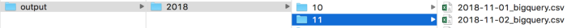

# Airflow with Google BigQuery and Slack

Airflow is an open source tool for creating, scheduling, and monitoring data processing pipelines. Airflow can be installed via `conda install -c conda-forge airflow` or `pip install airflow`. Before running airflow, we need to initiate the database `airflow initdb`.

Then we can start the airflow webserver, which a python flask app providing the UI of airflow. The default port of the webserver is 8080: `airflow webserver -p 8080`. When we open 0.0.0.0:8080 in the browser, we can see a bunch of airflow examples/DAGs.

DAGs (directed acyclic graphs) represent workflows of multiple tasks with some sort of dependencies among them. The Graph View of a DAG usually shows clearly the logics of the workflow.

In this example below, I’m interested in working with a BigQuery public dataset, San Francisco 311 service requests data, and counting how many requests were reported to each agency on a daily basis. Of course, we can run this query directly on BigQuery manually. However, with airflow, we can save the daily count data automatically and never need to worry about it. Here I am saving daily output to a csv file. And there are a lot of things we can do to add onto the daily airflow schedule. Here I am just demonstrating this simple daily aggregation task.

To start, let’s import some useful python libraries.
```
from airflow import DAG
from airflow.operators.python_operator import PythonOperator
import datetime
from datetime import timedelta
import os, errno
from os.path import dirname, exists
from os import listdir, makedirs
import subprocess
import requests
```

Then, we need to decide where we would like all our output files to go. I defined my output paths in a list in the `output_path` variable.
```
output_path = ['','Users', 'YOUR USER NAME','airflow','dags','example','output']
```

One thing I like to do is to send failure messages to slack. Every time when airflow fails to run for a given step, I’d like airflow to send a failure message to slack. Full credit to Christopher Flynn, I adapted [his codes](https://flynn.gg/blog/airflow-mods/) to do this step. First, I defined my base url for the web GUI. For local computers, the base url is usually http://0.0.0.0:8080. If you are running the airflow on a server, you should change the url accordingly. Next, I defined a send_slack function, which includes the information I’d like to send in the slack message. Note that you will need to go to the slack website and get a webhook url for the channel you’d like to use. The failure message will be sent directly to this webhook url. No authentication token is needed from slack. Then we need to define some default arguments. The most important thing here is to define ‘on_failure_callback’ as send_slack.

```
#define web gui url
BASE_URL = "http://0.0.0.0:8080"
#define send_slack function
def send_slack(context):
    dag_id = context["dag"].dag_id
    task_id = context["task"].task_id
    author = context["dag"].owner
    dag_run = context['dag_run'].run_id
    job_id = context['task_instance'].job_id
    try_number = context['task_instance'].try_number
    execution_date = context["execution_date"].strftime("%Y-%m-%dT%H:%M:%S")
    log_url = f"{BASE_URL}/admin/airflow/log?task_id={task_id}&dag_id={dag_id}&execution_date={execution_date}"
    
    attachment = {
        "fallback": f"<{log_url}|View failure log>",
        "color": "danger",
        "pretext": f"<{log_url}|View failure log>",
        "author_name": author,
        "fields": [
           {"title": "Failed task",
            "value": f"dag_id:{dag_id};\
            task_id:{task_id};\
            run_id:{dag_run};\
            job_id:{job_id};\
            try_number:{try_number}",
            "short": False}]}
    payload = {"text": "", "attachments": [attachment]}
    response = requests.post('COPY AND PASTE SLACK WEBHOOK URL HERE', json=payload)
    
    return response

#define default arguments
default_args = {
    'owner': 'airflow',
    'depends_on_past': False,
    'start_date': datetime.datetime(2018, 11, 1),
    'end_date': datetime.datetime(2018, 11, 3),
    'on_failure_callback': send_slack,
    'retries': 3,
    'retry_delay': timedelta(days=1)}
```

Finally, we can define our DAG.

Let’s name our DAG as ‘example’ here and set the schedule interval as daily.

```
dag = DAG(
    'example',
    default_args = default_args,
    schedule_interval='@daily')
```

Then we can add task instances to our DAG.

## First task instance: make separate folders for each year and month.

I defined a make_folder function where I make the year and month folders of the current execution date if they are not already exist. Then I used a airflow PythonOperator to call on this function.
```
#Make separate folders for each execution
def make_folder(**kwargs):
    query_date = kwargs.get('execution_date')
    folder_path = os.path.sep.join(output_path [query_date.strftime('%Y')]+[query_date.strftime('%m')])
    if not exists(folder_path):
        makedirs(folder_path, exist_ok=True)
make_folder = PythonOperator(
    task_id='make_folder',
    python_callable=make_folder,
    provide_context=True,
    dag=dag)
```
This is just my way of organization output files. I’d like to have a separate folder for each month. And then later I can output all my daily output files to the corresponding month folder.



## Second task instance: download daily aggregated Bigquery data
I defined a download_aggregated_bigquery_data function and used a PythonOperator to call this function. In my function, I basically used BigQuery command line language to query the dataset and do the aggregation. I set the query data as a parameter, so that it can query different dates everyday.

Note that airflow has a built-in BigQueryOperator. However, I couldn’t find how to output the results to a csv file or other format of files stored outside of BigQuery. Because usually I need to do either visualization or modeling outside of BigQuery, it is important for me to save the output data somewhere on my computer or on the server. Let me know if you know how to do this.

```
def download_aggregated_bigquery_data(**kwargs):
    query_date = kwargs.get('execution_date')
    
    cmd = ("""bq --format=csv query \
    --max_rows=1000000000 \
    --use_legacy_sql=false\
    --parameter='query_date:TIMESTAMP:{0}' \
    '
    SELECT agency_name, count(*) as counts from `bigquery-public-data.san_francisco_311.311_service_requests`
    WHERE CAST(created_date as DATE) = CAST(@query_date AS DATE)
    GROUP BY agency_name
    ' > {1}/{2}-{3}-{4}_bigquery.csv""").format(
        query_date,
        os.path.sep.join(output_path+[query_date.strftime('%Y')]+ [query_date.strftime('%m')]),
        query_date.strftime('%Y'),
        query_date.strftime('%m'),
        query_date.strftime('%d'))
    subprocess.call(cmd,shell=True)
download_aggregated_bigquery_data= PythonOperator(
    task_id='download_aggregated_bigquery_data',
    python_callable=download_aggregated_bigquery_data,
    provide_context=True,
    dag=dag)

```

## Add dependencies to the tasks
I would like to make the folder first, and then download the aggregated bigquery data.
```
make_folder.set_downstream(download_aggregated_bigquery_data)
```
This is a very basic example demonstration how to use airflow with slack and BigQuery. Normally after getting the data from BigQuery, users can add more task instances to do more data processing, visualization, and modeling.

## Test DAG
I normally test each of the instances before running the whole DAG. We can run the following commands. The format is `airflow test dag_id task_id execution_date`.

```
airflow test example make_folder 2018-12-01
airflow test example download_aggregated_bigquery_data 2018-12-01
```

## Activate DAG
Now we can to turn on the airflow scheduler and activate the DAG we just defined. Note that airflow webserver and airflow scheduler are two completely separate things. Even though you see the DAG on the webserver, it won’t run until you click the pause button to turn it to ‘on’ on the webserver and run `airflow scheduler` in the command line.

By Sophia Yang on [December 8, 2018](https://sophiamyang.medium.com/airflow-with-google-bigquery-and-slack-messaging-9ffa643e29ef).