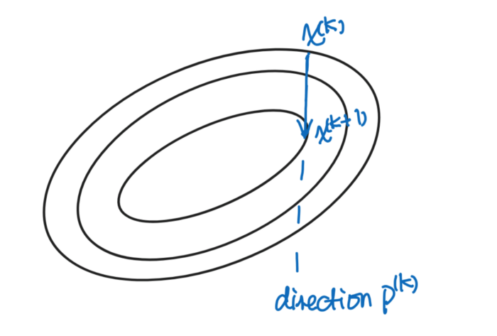
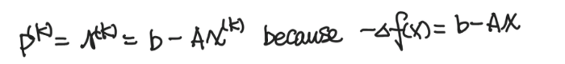
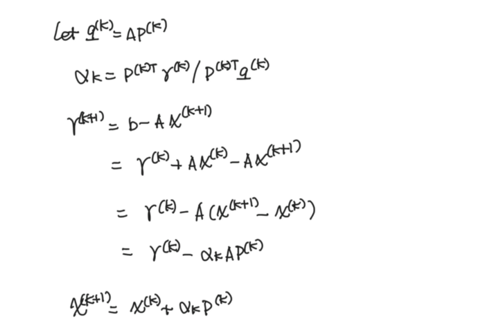
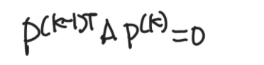
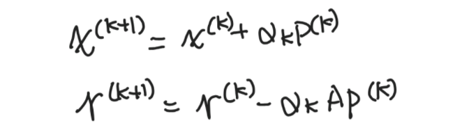

# Descent method — Steepest descent and conjugate gradient
Let’s start with this equation and we want to solve for x:

$Ax = b $

The solution x the minimize the function below when A is **symmetric positive definite** (otherwise, x could be the maximum). It is because the gradient of f(x), ∇f(x) = Ax- b. And when Ax=b, ∇f(x)=0 and thus x is the minimum of the function.

$f(x) = \frac{1}{2}x^TAx-x^Tb$

In this article, I am going to show you two ways to find the solution x — method of Steepest Descent and method of Conjugate Gradient.

## Method of Steepest Descent
The main idea of the descent method is that we start with a starting point of x, try to find the next point that’s closer to the solution, iterate over the process until we find the final solution.

For example, at step k, we are at the point 𝑥(𝑘). How do we decide where to go next? Which direction should we go? How much should we go?

Let’s assume the direction we decide to go is p(k) and how far we are going down the direction is 𝛼. Then the next data point can be written as:

For each step, the steepest descent method wants to go down towards the steepest slope, where it is the most effective (r here means residual):

Once we decided the direction to go, we want to make sure we minimize the function in this direction:

Now we can get calculate the x and the residual for the next data point:

This is basically the math behind the steepest descent method. Normally we would give a stopping criterion to the residual, and we iterate the process until we reach the stopping point.

## Conjugate gradient method
The steepest descent method is great that we minimize the function in the direction of each step. But it doesn’t guarantee that the direction we are going to minimize the function from all the previous directions. Here we introduce a very important term A conjugate directions. Directions p are A conjugate directions if they have the following property (note A is symmetric positive definite):

Only when the current direction p is A conjugate to all the previous directions, will the next data point minimize the function in the span of all previous directions.

The issue is how do we calculate the search direction p when p has to be A conjugate?

Remember that the steepest descent chose the steepest slope, which is also the residual (r) at each step. And we know that this is a good choice. How about we find an A-conjugate direction that’s the closest to the direction of the steepest descent, i.e., we minimize the 2-norm of the vector (r-p).

Through calculations, we know that the current direction is a combination of the current residual and the last direction.

Because of the property of A-conjugate directions:

We can then calculate 𝛾_𝑘:

In summary, the conjugate gradient method is as follows:

Now you know how to solve the system of linear equations using the steepest descent and the conjugate gradient method! Enjoy!

Reference:   
https://www.cs.utexas.edu/users/flame/laff/alaff/chapter08-important-observations.html 

By Sophia Yang on [September 16, 2020](https://towardsdatascience.com/descent-method-steepest-descent-and-conjugate-gradient-math-explained-78601d8df3ce)