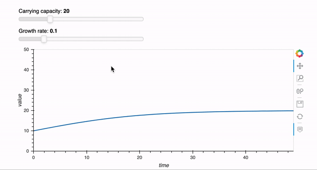
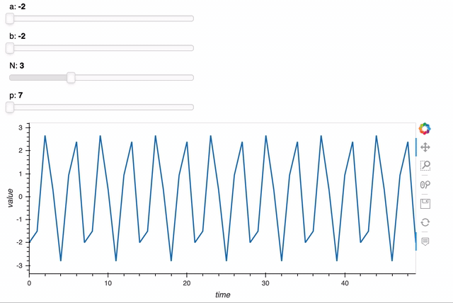

# Time series analysis using Prophet in Python — Part 1: Math explained

Prophet models time series as a generalized additive model (GAM) combining the trend function, seasonality function, holiday effects, and an error term in one model:

$y(t) = g(t) + s(t) + h(t) + \epsilon_t $

- $g(t)$ : trend (non-periodic changes)  

- $s(t)$ : seasonality (periodic changes) 

- $h(t)$ : holiday effect  

- $\epsilon_t$: error term, default prior $\epsilon \sim N(0, 0.5)$ 

## 1. Trend model

### Logistic trend model

The logistic trend model is based on the logistic growth model:

$g(t) = \frac{C}{1+\exp{(-k(t-m)}}$  

- C: carrying capacity  

- k: growth rate   

- m: offset parameter  

Here is an example plotting g(t) with m=0 and t from 0 to 49. As we can see here, carrying capacity and growth rate may change and the resulting logistic growth model will look very differently.

syntax for the plot:

#### Carrying capacity can change over time
To indicate that the carrying capacity is a function of time. We can write C as C(t).

#### Growth rate can change overtime
With $𝛿_𝑗$ change in growth rate at time $𝑠_𝑗$, growth rate becomes:

$k + \sum_{j:t>s_j}{\delta_j}$

Here is another way to write this equation. We can vectorize the change 𝛅 and create a vector 𝐚(𝑡) to indicate when change happens.

- $\textbf{a}(t) \in \{0,1\}^s$

- $a_j(t) = \begin{cases}1 & if  t \ge s_j\\0 & otherwise\end{cases}$

- growth rate at time t becomes: $k+\textbf{a}(t)^T\textbf{δ}$

With those two changes, the logistic trend model can be written as:

$g(t) = \frac{C(t)}{1+\exp{(-(k+\textbf{a}(t)^T\textbf{δ})(t - (m + \textbf{a}(t)^T\gamma)))}}$  

### Linear trend model

And similarly, the linear trend model can be written as:

$g(t) = {(k+\textbf{a}(t)^T\textbf{δ})t + (m + \textbf{a}(t)^T\gamma)}$  

Note that 𝛾 here is to adjust the offset parameter to connect the endpoints of segments.

### Parameters
- $c(t)$ user defined

 
- Prior $m \sim N(0, 5)$ 

- $s_j$ automatically selected 

- Prior ${δ}_j \sim Laplace(0, \tau)$  
    - $\tau$ regularizes trend felexibility 

- $\gamma$ calculated based on other parameters

## 2. Seasonality

Seasonality is modeled based on the Fourier series:

$s(t) = \sum(a_n\cos(\frac{2\pi nt}{P}) + b_n\sin(\frac{2\pi nt}{P})) = X(t) \beta$

- N: order of Fourier series
- P: period

Which can be rewritten as 𝑋(𝑡)𝛽 with X(t) and 𝛽 specified as vectors:

-  $X(t) = [\cos(\frac{2\pi 1t}{P}),\sin(\frac{2\pi 1t}{P}), ...\cos(\frac{2\pi Nt}{P}),\sin(\frac{2\pi Nt}{P}) ]$
  
-  $\beta = [a_1, b_1, ... a_N, b_N]$

Here is an example of the series and how the function changes regarding to a, b, N, and p (assuming a = a1 =… =aN and b = b1 =…= bN for simplicity).

Syntax for this plot:

### Parameters
- For yearly seasonality, default N=10, P=365.25

- For weekly seasonality, default N=3, P=7

-  Prior $\beta \sim N(0, \sigma^2)$   
    - $\sigma$ regularizes the strength of seasonality

## 3. Holiday model

Holiday model models the linear effect of the holidays, which is a vector of dummies (1 indicates holiday and 0 otherwise):

$Z(t) = [1(t \in D_1),..., 1(t \in D_L)]$

$h(t) = Z(t)\kappa$

### Parameters
Prior $\kappa \sim N(0, \nu^2) \sim default N(0, 0.5)$

## Final model 
Combining all three models together, we get the final model for our time series analysis:

$ y|m, \delta, \beta, \kappa,\epsilon,   \sim N(g(t) + s(t) + h(t), \epsilon) $ 

Then based on the priors of the parameters and the data, we can find maximum a posterior (MAP) estimates for all parameters.

## What are the parameters we can tune in Prophet?
### 1. growth
- Default: "linear" 
- Alternative: "logistic 
    
    
### 2. changepoint prior scale 
- $\tau$
- Default: 0.05 
- Higher value means more changepoints and more flexible trend 

### 3. changepoint range:
- Defult: 0.8 
- changepoints only apply to 80% of the data to better project forward and avoid overfitting at the end 
    
    
### 4. seasonality prior scale
- $\sigma$
- Default: 10

    
### 5. holidays_prior_scale
- $\nu$
- Default: 10
- Lower values means lower holiday effects. Reduce the value to avoid overfitting of the holiday effect. 
 
 
### 6. seasonality_mode
- Default: "additive", i.e., $g(t) + s(t)$
- Alternative : "multiplicative", grows with the trend, i.e., $g(t)*s(t)$

### 7. yearly_seasonality
- Order of the Fourier series 
- Default: False; if yearly_seasonality=True, default 10
- Higher value corresponds to higer frequent changes
     
    
### 8. weekly_seasonality
- Order of the Fourier series 
- Default: 3
- Higher value corresponds to higer frequent changes

### Other features:
#### 1. Locations of changepoints
- automatic detected
- can be specified using `changepoints = [dates]`
#### 2. Speficy seasonalities
- Defaults: weekly and yearly seasonalities
- can add additional seasonalities (e.g., monthly) using `add_seasonality`
#### 3. Additional regressors
- we can add additional regressors using `add_regressor`
#### 4.Uncertainty 
- Trend: we assume similiar trend changes in the future. Higher changepoint prior scale lead to higher uncertainty.
- Seasonality: we need to use MCMC sampling to get the uncertainty in seasonality 
Next, I am going to show you how to use Prophet and how to tune your model in practice. Check it out!

References:    
https://peerj.com/preprints/3190.pdf   
https://facebook.github.io/prophet/docs/quick_start.html

By Sophia Yang on [July 8, 2020](https://medium.com/analytics-vidhya/time-series-analysis-using-prophet-in-python-part-1-math-explained-5936509c175c)