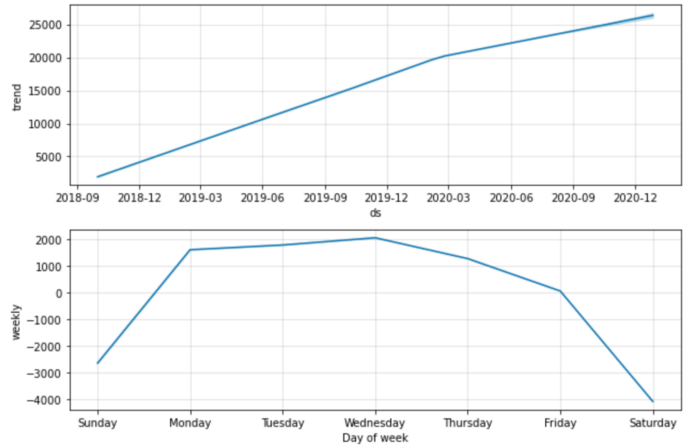

# Time series analysis using Prophet in Python — Part 2: Hyperparameter Tuning and Cross Validation

In the previous article, we explained all the math behind Prophet. This article, I am going to show you how to use Prophet in practice and how to do hyperparameter tuning.

## Dataset
Let’s start with a real time series dataset. Since we are using Prophet, let’s see how many times Prophet has downloaded from PyPI. Here we get the daily download counts by running this Google Bigquery command in subprocess (Note that you’ll need to install Google Cloud SDK https://cloud.google.com/sdk/docs/downloads-yum to be able to run the bq command to query data from Bigquery):

<script src="https://gist.github.com/sophiamyang/084b141461dbc7d31402731a2873c92a.js"></script>

Let’s load the data. Here we can see that there are 637 observations. The date is from 2018–10–01 to 2020–06–30 as we have defined in the query. The max number of daily downloads is 32258. (We didn’t query any data before 2018–10–01 is because data before that is not reliable in PyPI).


## Basic Prophet model
Now we can run Prophet on our data. First, we need to make sure that our date is in the datetime format by running pd.to_datetime. Second, we need to rename the columns to ds and y , which are the required names by Prophet.

Then, we can instantiating a Prophet object m, fit the our data into the model, make future predictions, plot the prediction, and run cross validation to inspect the model fit.

<script src="https://gist.github.com/sophiamyang/4deaf1991927b96f35e3425d83f534c4.js"></script>


*fig1*


*fig2*

Fig1 shows the general trend and the forecasting trend and Fig2 shows the the trend component and the weekly effect separately. As we can see from the figures, the number of downloads of Prophet grows steadily over time and people download it more on the weekdays.

## Model fit
Cross validation in Prophet uses historical data and compares the forecasted values with the real values in history. There are three parameters we need to define in the cross_validation function:
- initial: the size of the initial training period, default is 3*horizon
- period: space between two or more training periods, i.e., cutoff dates, default is 0.5*horizon
- horizon: forecasting horizon, i.e., how many days are we going to make forecast on.

In our example, since we only have 637 days, I chose smaller values of those parameters. I am using the initial 400 days to predict the next 180 days. The period is not really used here. Because I only have enough data to do the prediction once. If you have lots of data. you may do this 180 day forecast many times and make predictions every 90 days.

df_p is the performance matrix showing several model fit statistics:
- MS: mean squared error
- RMSE: root mean squared error
- MAE: mean absolute error
- MAPE: mean absolute percent error
- MDAPE: median absolute percent error


*df_p*

fig3 shows the MAPE for the forecast. The percentage error for this prediction ranges from around 8% to 25%.


## Hyperparameter tuning
The previous model did not specify any parameters in the model and uses all the default parameters. If you would like to know what are the default parameters in Prophet, check out my previous [article](https://sophiamyang.github.io/DS/timeseries/timeseries1.html).


Here we define a param_grid of all the parameters and values we want to loop through, and then calculated the mean value of the performance matrix, and get the best parameter combination in terms of MAPE. The syntax below is based on this [notebook](https://nbviewer.jupyter.org/github/ryankarlos/prophet/blob/9e6d9548d1caca27af3367819bab10a65da10392/notebooks/diagnostics.ipynb#Hyperparameter-Optimisation) with few revisions.

<script src="https://gist.github.com/sophiamyang/d19946e1c135b55e0836e794b7454a0e.js"></script>

The result shows the best parameter combination for our data:
```
The best param combination is {'changepoint_prior_scale': 5.0, 'changepoint_range': 0.8, 'seasonality_prior_scale': 10.0, 'holidays_prior_scale': 1.0, 'seasonality_mode': 'additive', 'growth': 'logistic', 'yearly_seasonality': 10}
```

Then we can use this set of parameters in our final model:
```
m= Prophet(
    changepoint_prior_scale=5,
    changepoint_range=0.8,
    seasonality_prior_scale=10,
    holidays_prior_scale= 1,
    seasonality_mode='additive',
    growth='logistic', 
    yearly_seasonality= 10
)
m.add_country_holidays(country_name='US')
m.fit(df)
future = m.make_future_dataframe(periods=180) 
future['cap'] = 60000
future['floor'] = 0
forecast = m.predict(future)
fig21 = m.plot(forecast)
fig22 = m.plot_components(forecast)
```

With our final model, we see a lot more details. The forecasting is actually going down a little bit, although there is a high variance in the trend mostly due to the ups and downs in the changepoints. In addition, we can see the holiday effects, weekly effects, and yearly effects. Looks like for most holidays, the downloads of Prophet decreased and the yearly effect looks like a summer dip.


## Parallel computing
### Cross-validation
The cross validation process can use dask in the backend to do parralell computing. Here are some examples: [example 1](https://github.com/dask/dask-examples/blob/master/applications/forecasting-with-prophet.ipynb), [example 2](https://github.com/facebook/prophet/blob/30bcfed91872015ed6b864b29b7886e03e7a87f6/notebooks/diagnostics.ipynb). Basically, we just need to add `parallel="dask"` when we call the `cross_validation` function.

```
from dask.distributed import Client

client = Client()  # connect to the cluster
df_cv = cross_validation(m, initial='400 days', period='90 days', horizon='180 days', parallel="dask")
```

### Hyperparameter tuning
The grid search process can take a long time to run. We can also use dask to distribute the task to multiple workers and speed up the process. Here is a [notebook](https://nbviewer.jupyter.org/gist/TomAugspurger/8619e223ea42c922cd655d18d6c96424) showing how to do the hyperparameter tuning in task.
That’s it! Thanks for reading!


References:  
https://nbviewer.jupyter.org/github/ryankarlos/prophet/blob/9e6d9548d1caca27af3367819bab10a65da10392/notebooks/diagnostics.ipynb#Hyperparameter-Optimisation    
https://facebook.github.io/prophet/   
https://nbviewer.jupyter.org/github/ryankarlos/prophet/blob/9e6d9548d1caca27af3367819bab10a65da10392/notebooks/diagnostics.ipynb#Hyperparameter-Optimisation    
https://nbviewer.jupyter.org/gist/TomAugspurger/8619e223ea42c922cd655d18d6c96424   
https://github.com/facebook/prophet/issues/1381   